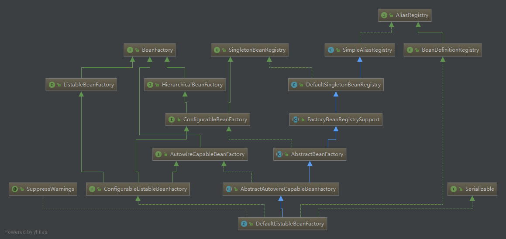

## Spring IOC 原理

#### 什么是IOC/DI

IoC的实现原理：就是工厂模式加反射机制。

IoC 容器：最主要是完成完成对象的创建和依赖的管理注入等等。

先从我们自己设计这样一个视角来考虑：
​	所谓控制反转，就是把原先我们代码里面需要实现的对象创建、依赖的代码，反转给容器来帮忙实现。那么必然的我们需要创建一个容器，同时需要一种描述来让容器知道需要创建的对象与对象的关系。这个描述最具体表现就是我们可配置的文件。

1. 对象和对象关系怎么表示？	

   可以用 xml ， properties 文件等语义化配置文件表示。

2. 描述对象关系的文件存放在哪里？

   可能是 classpath ， filesystem ，或者是 URL 网络资源， servletContext 等。

回到正题，有了配置文件，还需要对配置文件解析。
不同的配置文件对对象的描述不一样，如标准的，自定义声明式的，如何统一？ 在内部需要有一个统一的关于对象的定义，所有外部的描述都必须转化成统一的描述定义。
如何对不同的配置文件进行解析？需要对不同的配置文件语法，采用不同的解析器

#### Spring IOC体系结构？

1. BeanFactory

   Spring Bean的创建是典型的工厂模式，这一系列的Bean工厂，也即IOC容器为开发者管理对象间的依赖关系提供了很多便利和基础服务，在Spring中有许多的IOC容器的实现供用户选择和使用，其相互关系如下：

   

2. BeanDefinition

   SpringIOC容器管理了我们定义的各种Bean对象及其相互的关系，Bean对象在Spring实现中是以BeanDefinition来描述的，Bean 的解析主要就是对 Spring 配置文件的解析。

#### IoC容器的初始化

1、 XmlBeanFactory(屌丝IOC)的整个流程；

2、 FileSystemXmlApplicationContext 的IOC容器流程；

1、高富帅IOC解剖；

2、 设置资源加载器和资源定位；

3、AbstractApplicationContext的refresh函数载入Bean定义过程；

4、AbstractApplicationContext子类的refreshBeanFactory()方法；

5、AbstractRefreshableApplicationContext子类的loadBeanDefinitions方法；

6、AbstractBeanDefinitionReader读取Bean定义资源；

7、资源加载器获取要读入的资源；

8、XmlBeanDefinitionReader加载Bean定义资源；

9、DocumentLoader将Bean定义资源转换为Document对象；

10、XmlBeanDefinitionReader解析载入的Bean定义资源文件；

11、DefaultBeanDefinitionDocumentReader对Bean定义的Document对象解析；

12、BeanDefinitionParserDelegate解析Bean定义资源文件中的<Bean>元素；

13、BeanDefinitionParserDelegate解析<property>元素；

14、解析<property>元素的子元素；

15、解析<list>子元素；

16、解析过后的BeanDefinition在IoC容器中的注册；

17、DefaultListableBeanFactory向IoC容器注册解析后的BeanDefinition；

#### IOC容器的依赖注入

1、依赖注入发生的时间；

2、AbstractBeanFactory通过getBean向IoC容器获取被管理的Bean；

3、AbstractAutowireCapableBeanFactory创建Bean实例对象；

4、createBeanInstance方法创建Bean的java实例对象；

5、SimpleInstantiationStrategy类使用默认的无参构造方法创建Bean实例化对象；

6、populateBean方法对Bean属性的依赖注入；

7、BeanDefinitionValueResolver解析属性值；

8、BeanWrapperImpl对Bean属性的依赖注入；

#### IoC容器的高级特性

1、介绍

2、Spring IoC容器的lazy-init属性实现预实例化：

​	(1) .refresh()；

​	(2).finishBeanFactoryInitialization处理预实例化Bean；

​	(3) .DefaultListableBeanFactory对配置lazy-init属性单态Bean的预实例化；

3、FactoryBean的实现：

​	(1).FactoryBean的源码如下；

​	(2). AbstractBeanFactory的getBean方法调用FactoryBean；

​	(3)、AbstractBeanFactory生产Bean实例对象；

​	(4).工厂Bean的实现类getObject方法创建Bean实例对象；

4、BeanPostProcessor后置处理器的实现：

​	(1).BeanPostProcessor的源码如下；

​	(2).AbstractAutowireCapableBeanFactory类对容器生成的Bean添加后置处理器；

​	(3).initializeBean方法为容器产生的Bean实例对象添加BeanPostProcessor后置处理器；

​	(4).AdvisorAdapterRegistrationManager在Bean对象初始化后注册通知适配器；

5、Spring IoC容器autowiring实现原理：

​	(1). AbstractAutoWireCapableBeanFactory对Bean实例进行属性依赖注入；

​	(2).Spring IoC容器根据Bean名称或者类型进行autowiring自动依赖注入；

​	(3).DefaultSingletonBeanRegistry的registerDependentBean方法对属性注入；

**备注**：https://www.cnblogs.com/ITtangtang/p/3978349.html